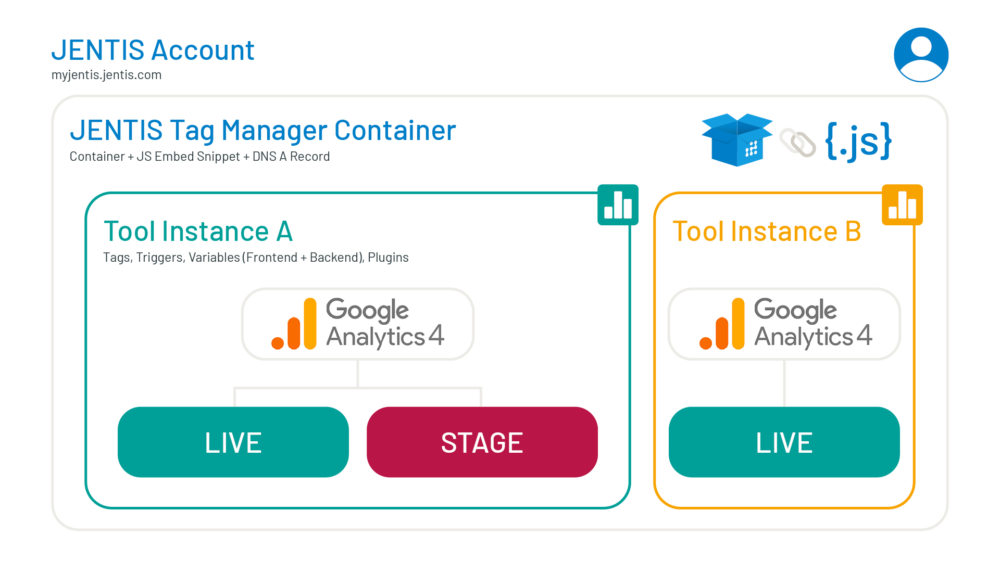

## [](https://docs.jentis.com/documentation/jentis-accounts-and-containers#JENTISAccountsandContainers-Hierarchies "Copy to clipboard")Hierarchies

JENTIS has a three-level hierarchy:

1. **JENTIS Platform Account:** This is the highest level of administration. In general, an account represents a single company and has one single point of contact. Here, you log in and can manage users, containers, and environments.

2. **Container:** A container is always directly connected to a domain and a JavaScript embed snippet.

3. **Container Environment:** Part of the JavaScript embed snippet is the definition of an environment. Per default, a JENTIS Container will always have two: `stage` and `live`.

The JENTIS hierarchy and structure are mirrored in its code. In other words, the JENTIS server-side tracking architecture as a first-party solution forms the foundation for scaling across multiple sites. Each integration must be implemented in a first-party context, making it inevitable to have different JavaScript snippets, DNS A records, and containers.

## Implementation Details

Let's have a look at the generic short version of the JENTIS Code Snippet:

```javascript
<script>
(function (sCDN,sCDNProject,sCDNWorkspace,sCDNVers) {
            ... // shortened for brevity
        })("https://JENTIS_SUBDOMAIN.mydomain.com","JENTIS_CONTAINER_NAME","JENTIS_CONTAINER_ENVIRONMENT","_");
</script>
```

Now, there are multiple dynamic parameters in that code:

* `JENTIS_SUBDOMAIN`: This is a dynamically generated value where you must map the DNS A record entry. All details are shared in your JTM account setup guide.

* `JENTIS_CONTAINER_NAME`: This refers to the name of your container, which will be used with the JS embed snippet.

* `JENTIS_CONTAINER_ENVIRONMENT`: Either `stage` or `live`.

## How to Grow and Scale

In your JENTIS Data Capturing implementation life cycle, you will soon be confronted with the question of how to set up your account, containers, and tools to maximize the efficiency and accessibility of the data pipelines.

In the next sections, we will discuss your options and the concepts behind them, helping you resolve the question of how many containers and tool instances you actually need.

Here are the topics you should consider when setting up your account:

### [](https://docs.jentis.com/documentation/jentis-accounts-and-containers#JENTISAccountsandContainers-ContainerConfiguration "Copy to clipboard")**Container Configuration**

* To define the right number of containers on your account, please consider:

  * How many websites (domains) do you have? Are they similar in nature (same data, same requirements)? Can they be grouped where the requirements overlap (same tools with the same conversion goals)?

  * Do you want to split a single website (domain) into multiple sections (i.e., by subdomain)? Do they require separate management and have different requirements (e.g., different data, different tools, and different conversion goals)?

* Once you consider these questions, you have some options to configure your containers: 

  * **Multiple containers for one same domain**: We recommend that you use this option if your website has multiple subdomains with particular management requirements—different data, tools, and conversion goals.For example, on the main domain `example.com`, you have `shop.example.com` and `blog.example.com`. While the first has a clear purchase conversion type and an e-commerce structure, the second is a content website. You could configure one container for each of these.

  * **One container for the same domain and all its subdomains**: We recommend using this option if your website has multiple subdomains that share the same type of data, tools, and conversion goals.For example, your main domain, `example.com`, has the subdomains `de.example.com` and `at.example.com`. These are all e-commerce pages with the same structure and purchase conversion goal, just varying their language. You only need one set of configurations for these.

  * **One unique container per domain**: If you have different domains, you should configure one container for each one, as one container can not be used on multiple domains.For example, your company owns the websites `example.com` and `mycompany.com`. Each should be configured with a different container.

<Info>
  **Remember**: A container can hold multiple configured tools; it can be the same tool (e.g., GA4) with two different instances.

  Read more about tools and instances: [Tools](https://docs.jentis.com/documentation/tools)
</Info>

<Frame>
  
</Frame>

**In conclusion,** you can use a tool on multiple containers with the same configuration. It scales from bottom to top, hierarchy speaking. At the same time, you can have one container and run multiple tool instances on the same container, scaling from the top to the bottom. Both directions are possible.

So, it is up to you to see if a common tool definition applies to multiple containers, if you want to have a single container with multiple tools or even multiple containers with different tool definitions on the same website.

In the next two chapters, we will look into more complex topics when it comes to setting up your containers and tools.

a) **Shared elements**: reusing code, variables, triggers, etc., in multiple configurations.

b) **Sharing data**: accessing the same data with different tool instances.

### Sharing: Global and Local Elements

To efficiently handle multiple integrations, elements in the JENTIS Tag Manager have references to containers.

The following elements are either local definitions (you can select to which container those elements are implemented) or global (same for all containers, available in all containers). If a local element selects ALL containers, it becomes the same as a global element.

#### [](https://docs.jentis.com/documentation/jentis-accounts-and-containers#JENTISAccountsandContainers-Local:Container-BasedElements "Copy to clipboard")Local: Container-Based Elements

These JTM elements can be associated with all or only some Containers:

* **Tools**: Each tool configuration instance (Google Analytics, Facebook, etc.) is always connected to a container.

* **Tags**: Each tag is always part of a tool and shares its setting, making it always connected to containers selected in the appropriate tool.

* **Code Snippets:** All frontend code snippet elements are defined per container.

#### [](https://docs.jentis.com/documentation/jentis-accounts-and-containers#JENTISAccountsandContainers-Global:SharedElements "Copy to clipboard")Global: Shared Elements

These JTM elements are defined globally and are available to all containers:

* **Triggers**

* **Variables** (all Frontend, Backend, Static and Enriched Variables)

* **Transformation Functions**

* **States**

<Info>
  **Remember**: In your JENTIS account, you can have either a tool on multiple containers or a container with multiple different tool instances. Defining how multiple tools are connected to containers is up to you.

  If you want to manage a tool only once and share the configuration on multiple websites (domains), you can simply select it to be available in multiple containers.

  If a tool has a specific tag or configuration, then you can simply add a tool and assign it only to the required container.
</Info>

### Data Scopes - Sharing Informations

When deciding on the appropriate account and container structure for your project, you must consider the scope of data. By design, a tool and container in JENTIS will not automatically share data with any other container or tool instance.

This basically means that when you have two tools, **Web Analytics A** and **Web Analytics B,** and two containers, **Website X** and **Website Y**, the data between those will **not** be shared. A visitor with a `client-id` in **Web Analytics A** will be a different user and visitor, with its own unique `client-id`, in **Web Analytics B**.

The same is true for Containers. If a user navigates both websites, `website-X.com` and `website-Y.com`, they are two different identities in JENTIS, meaning there is no common identifier. Again, both web analytics tools will count two unique visitors.

Now, there is a solution for this:

#### [](https://docs.jentis.com/documentation/jentis-accounts-and-containers#JENTISAccountsandContainers-Cross-DomainTracking "Copy to clipboard")Cross-Domain Tracking

With Cross-Domain tracking, the same user in two containers will be identified as the same user in JENTIS by sharing the `user-id` on both websites. If you have configured your web analytics tool as a single tool configuration that is applied on both containers for **Website X** and **Website Y**, the data will be merged. As of now, the client ID is consistently the same, even if the user navigates back and forth between both websites.

See more information on [Cross Domain Tracking](https://docs.jentis.com/documentation/cross-domain-tracking)

### [](https://docs.jentis.com/documentation/jentis-accounts-and-containers#JENTISAccountsandContainers-SubdomainsandMulti-Containeronasingletop-leveldomain "Copy to clipboard")Subdomains and Multi-Container on a single top-level domain

Generally, we do not advise having multiple containers on a single top-level domain (e.g., ".my-website.com" is the top-level part of your domain, excluding any subdomain or www), as data between those containers will not be shared by default.

### Tool Instance Data Sharing Limitations

The general idea of a tool instance is that it is a single configuration for a generic tool in your account. The generic tool is the "parent" (e.g., "Google Analytics 4"), and a tool instance is your configuration of this tool (e.g., "Google Analytics 4 - EN Shop"), the "child.”

As we know, you can have multiple interpretations of the same generic tool (e.g., "Google Analytics 4 - EN Shop" and "Google Analytics 4—All Shops").  Currently, the data between both tools is not shared, so for example, GA4 has a `client-id` assigned for each user. This `client-id` will be different for "Google Analytics 4 - EN Shop" and "Google Analytics 4—All Shops". Even if JENTIS recognizes the same user, the scope of the data is per tool configuration instance.

Today, this limitation can not be worked around. If you must share data explicitly on the tool, you can do so by using this one tool for all applications, if possible (i.e. by selecting multiple containers with this tool so it operates on multiple websites).

## [](https://docs.jentis.com/documentation/jentis-accounts-and-containers#JENTISAccountsandContainers-BestPractices "Copy to clipboard")Best Practices

Now, we need to discuss some best practices and common questions, mainly about scaling multiple accounts/containers in a company with multiple websites on different domains.

**How can I use the same tool or tag on multiple implementations?**

All containers are maintained in a single JENTIS account.

So you can use the same tools, tags and codes in all or only in selected containers. You don’t need to copy-paste settings from one account to another. Even if the container and embed snippet is different on all domains, the JENTIS Tag Manager configuration is always managed globally in a single account.

**How do I set up a tool only in one domain?**

A domain is always connected to a single container; this is a 1:1 relationship. To implement a tool or a tag on only one container, you have to select only this one container.

**Can I have only one global container on multiple websites (domains)?**

No, a container, embed snippet, and DNS record are defined per domain. JENTIS is a first-party tool and can only be used in a first-party context. As the cookies set and associated with JENTIS are set via HTTP, this architecture does not support loading a third-party JS embed snippet, as the cookies would still be set in that third-party context via HTTP.

This is a browser security and data privacy measure that can not be circumvented.

**What is the best practice for shop sites such as** [**shop.domain.com**](http://shop.domain.com/) **, which is separate from the main domain I track on( eg.** [**domain.com**](http://domain.com/) **) ?**

The first thing you should confirm with your web manager is if the [shop.domain.com](http://shop.domain.com/) is treated as a subdomain or as a separate domain to your general website. The next thing to do would be to read our [**Main Domain Cookie**](https://docs.jentis.com/documentation/main-domain-cookie) article, which covers this exact use case scenario and all of the options you have in this regard.

To answer the above question shortly:

If your shop domain is a subdomain: There is no need to have multiple containers for subdomains (everything works technically fine with just one container). So a "one container strategy" is common and a good way to go.

However, if you want to have one more layer of abstraction and apply different containers for those subdomains individually for organizational purposes, then multiple containers might be a good idea. You can still very easily apply the same Tag/Trigger/Variable configuration for all containers. Simply select in a tool, on which containers this tool (with all it's setting) is to be applied. So scaling to multiple containers is convenient and easy with just one click.

By default multiple containers created for the same domain and each sub-domain will share data (the user-id is common to all containers). This is described in more detail in the “Main Domain Cookie” article linked above). If sharing data between container is not desired then you can just create each container and select to not use the Main Domain Cookie feature with each.